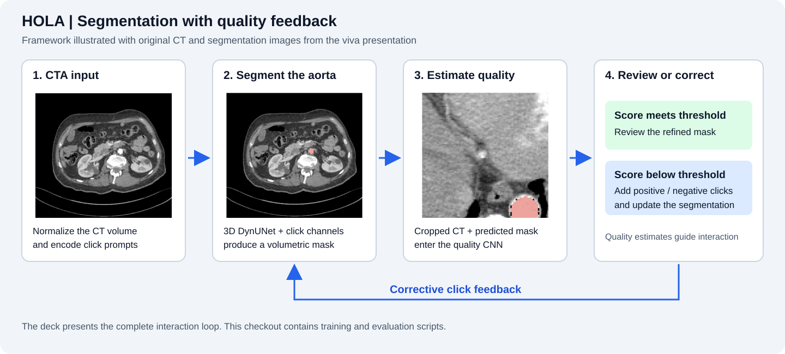
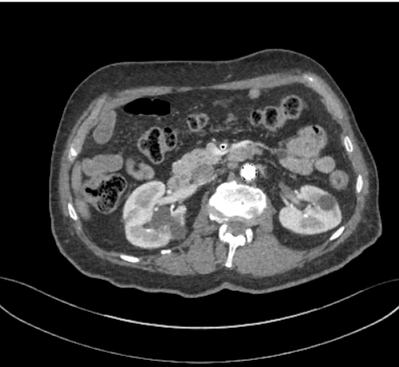
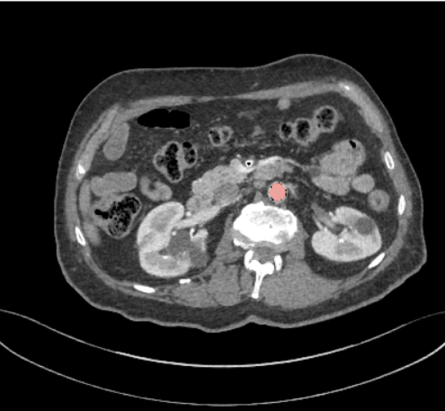
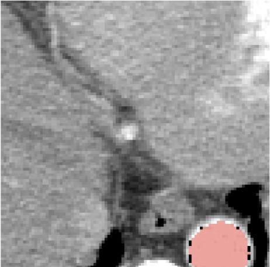
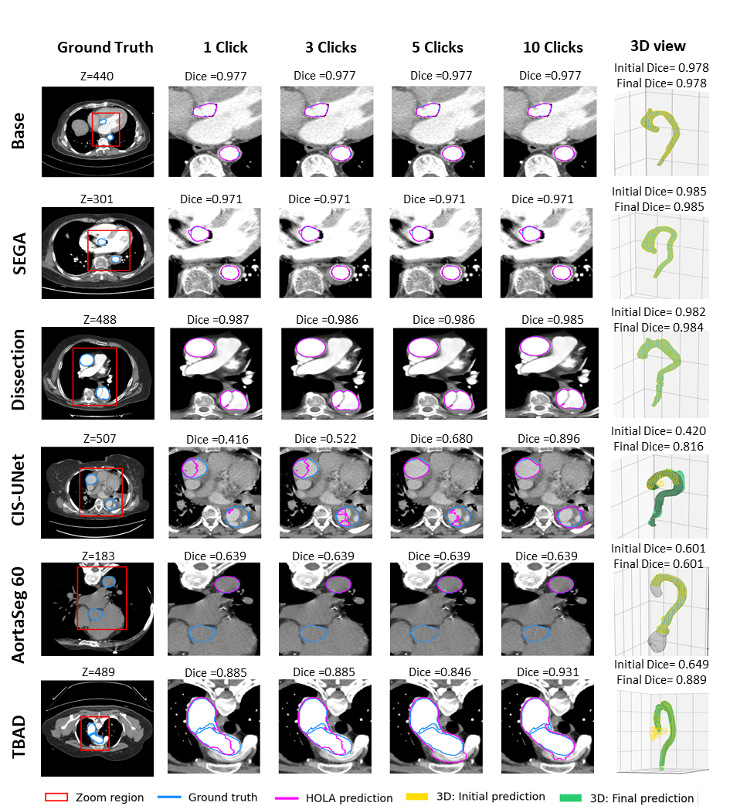
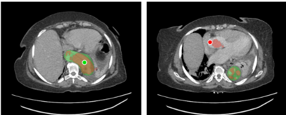
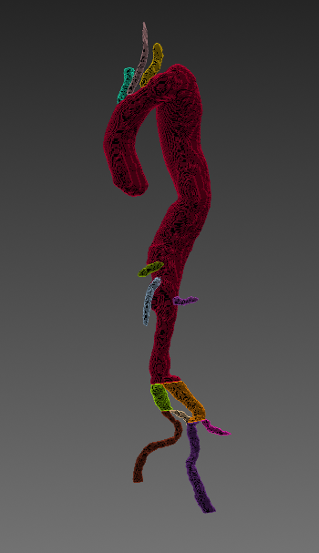
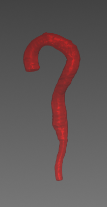
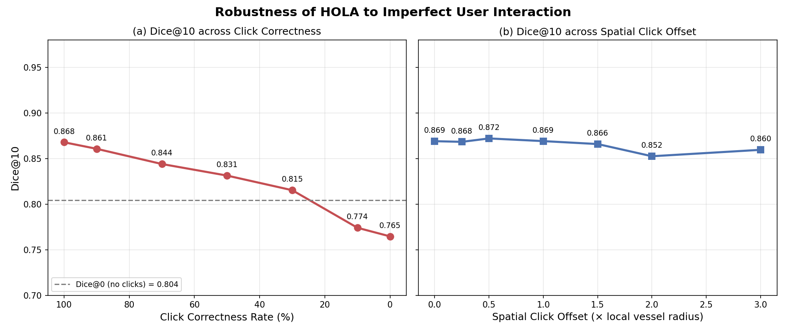

# HOLA_MICAD

### Interactive 3D aorta segmentation with simulated click corrections

HOLA_MICAD is a Python research pipeline for segmenting the aorta in CT volumes. It combines a three-channel MONAI DynUNet with positive and negative click prompts, then measures how segmentation quality changes as simulated corrections are added.

The repository brings together experiments on **dataset composition**, **interaction efficiency**, **click reliability**, and **segmentation completeness**, with MedSAM and MedSAM2 evaluation scripts for comparison.

*From CTA input to a predicted mask, quality estimation, and corrective feedback. The images come from slide 4 of the [HOLA viva presentation](docs/presentations/HOLA_Viva_Presentation.pptx); the diagram summarizes the framework presented there.*

[Segmentation examples](#segmentation-examples) · [Prototype interface](#prototype-interface) · [Reported results](#results-presented-in-the-viva) · [Code usage](docs/usage.md)

## Highlights

- **Volume segmentation with click prompts:** normalized CT, positive clicks, and negative clicks form three input channels. Clicks are encoded as Gaussian signals.
- **Controlled dataset experiments:** train on the base dataset, add optional datasets by size or a seeded random order, or sample a fixed-size training subset.
- **Interactive evaluation:** report Dice, intersection over union (IoU), 95th-percentile Hausdorff distance (HD95), and inference time across correction counts.
- **Interaction studies:** measure corrections needed to reach target Dice scores and test robustness to incorrect clicks.
- **Completeness estimation:** train a separate 3D CNN to predict Dice from CT and predicted-mask crops, then select a stopping threshold on validation data.
- **Research outputs:** export checkpoints, per-patient JSON records, plots, and LaTeX metric tables.

## Segmentation examples

### From an axial CT slice to an aorta mask

| CT input | Segmentation overlay | Cropped region for quality assessment |
| --- | --- | --- |
|  |  |  |

The pink overlay identifies the aortic region. The quality network receives CT and predicted-mask crops so it can estimate segmentation quality. These images illustrate the components; they do not show a measured before/after correction sequence.

*Slide 2: aortic overlays on three axial slices, illustrating how the target appears at different levels of the volume.*

### Segmentation across cohorts and correction steps

*Slide 9: examples from Base, SEGA, Dissection, CIS-UNet, AortaSeg60, and TBAD. Click the figure to inspect it at full size.*

**Reading the figure:** the first column shows the reference mask and the red region enlarged in the following columns. Blue contours mark ground truth; magenta contours mark HOLA predictions at **1, 3, 5, and 10 clicks**. The last column compares **initial (yellow)** and **final (green)** 3D predictions. The examples show both close agreement and remaining errors across different anatomy.

The original figure is preserved at its embedded resolution of **945 × 1043 pixels**. A white background keeps its labels readable in dark mode. [Download the original PNG](docs/images/segmentation-comparison.png).

### Positive and negative corrections

*Slide 3: examples of corrective interaction. Positive clicks indicate foreground to include; negative clicks indicate regions to exclude. In the experiment scripts, these clicks are simulated from reference masks and prediction errors.*

### Preparing the segmentation target

| Before preprocessing | After preprocessing |
| --- | --- |
|  |  |

*Slide 5: the presentation's before/after preprocessing illustration. The preprocessing implementation is external to this checkout.*

## Prototype interface

The viva presents a Streamlit prototype with linked CT views, mask overlays, click controls, and quality feedback. These screenshots document that prototype; its interface source is not included in this repository.

*Slide 7: axial and sagittal views with a displayed quality estimate and stopping message. The score and threshold belong to the pictured demonstration.*

*Slide 7: coronal review, 3D reconstruction, and controls for adding, undoing, or clearing clicks.*

## Results presented in the viva

Slide 6 reports the following outcomes. These values are transcribed from the presentation, rather than reproduced by a run of this checkout.

| Measure | Reported result |
| --- | --- |
| Dice, from 0 to 10 corrective clicks | **0.804 → 0.868** |
| Correlation between predicted quality and true Dice | **r = 0.953** |
| Quality prediction mean absolute error | **0.039** |
| Mean clicks under the stopping policy | **1.03** |

*Slide 6: the left panel varies click correctness; the right panel varies spatial click offset relative to local vessel radius. The dashed line marks the presentation's baseline Dice of 0.804. The original plot labels are retained; in this checkout's main evaluator, zero corrections still includes initial seed prompts. The spatial-offset experiment is shown in the deck but has no dedicated script in this checkout.*

All presentation images are stored locally in [docs/images](docs/images). See the [image source notes](docs/images/README.md) for slide references and figure construction details.

## Using the code

See the [code usage guide](docs/usage.md) for setup, dataset configuration, training and evaluation commands, and a reference to the experiment scripts.

## Project status

This repository provides the experiment implementation and visual results from the [viva presentation](docs/presentations/HOLA_Viva_Presentation.pptx). Raw benchmark outputs, trained checkpoints, the prototype interface source, a hosted demo, and a license file are not included in this checkout.
