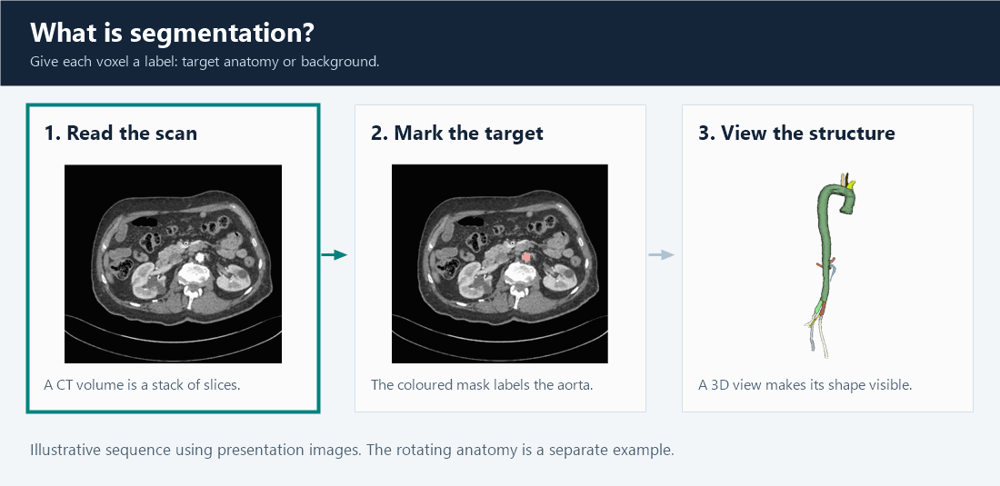
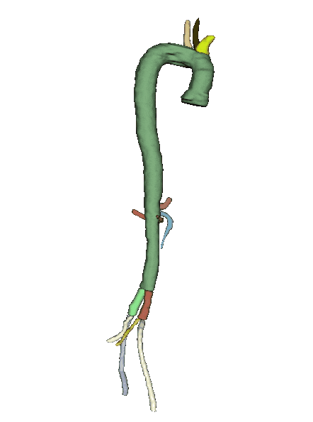
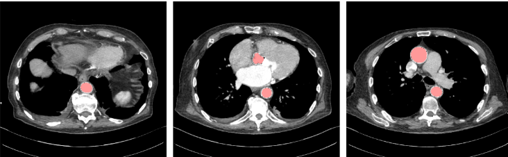
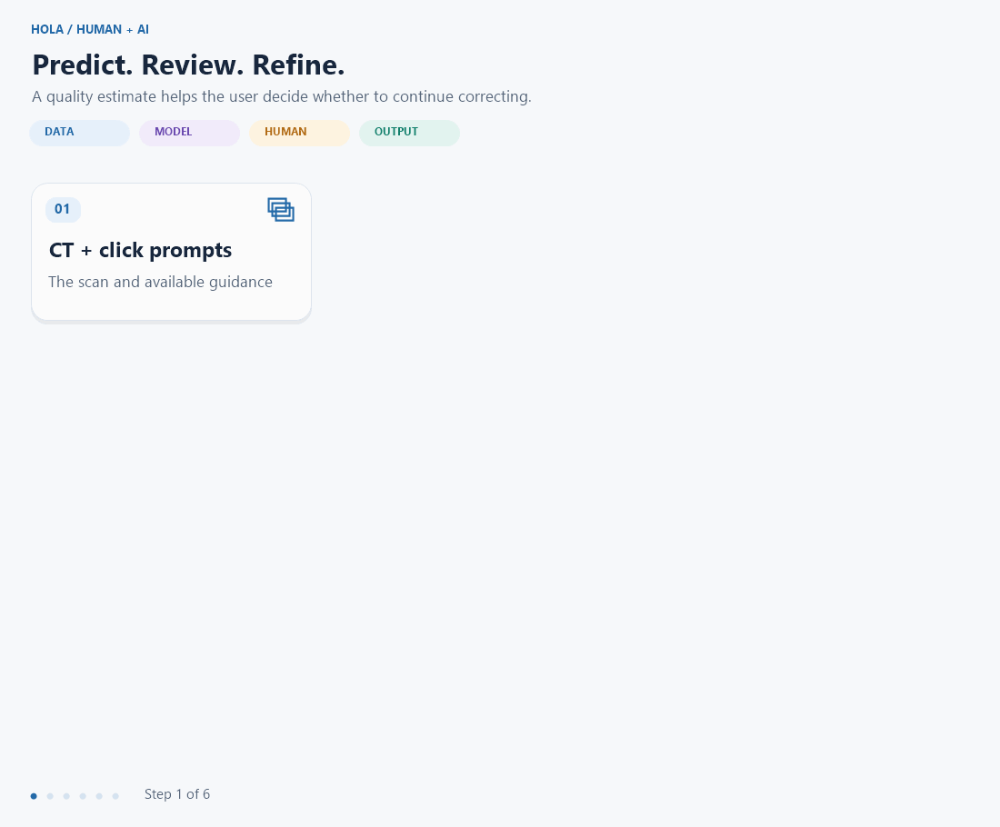
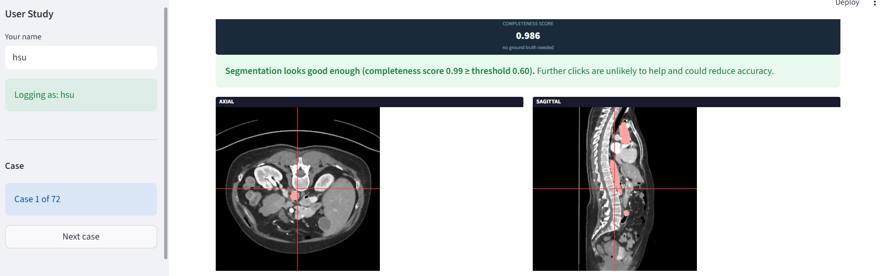
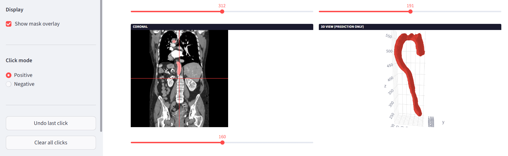
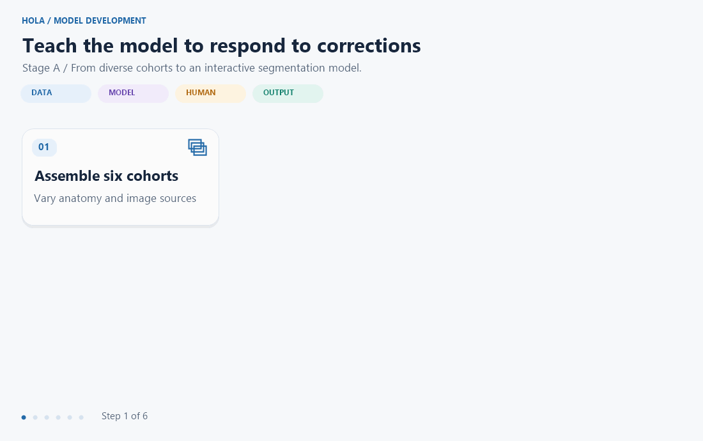
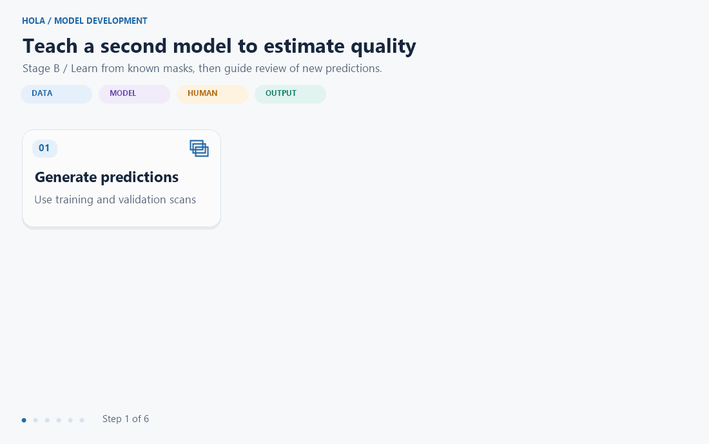
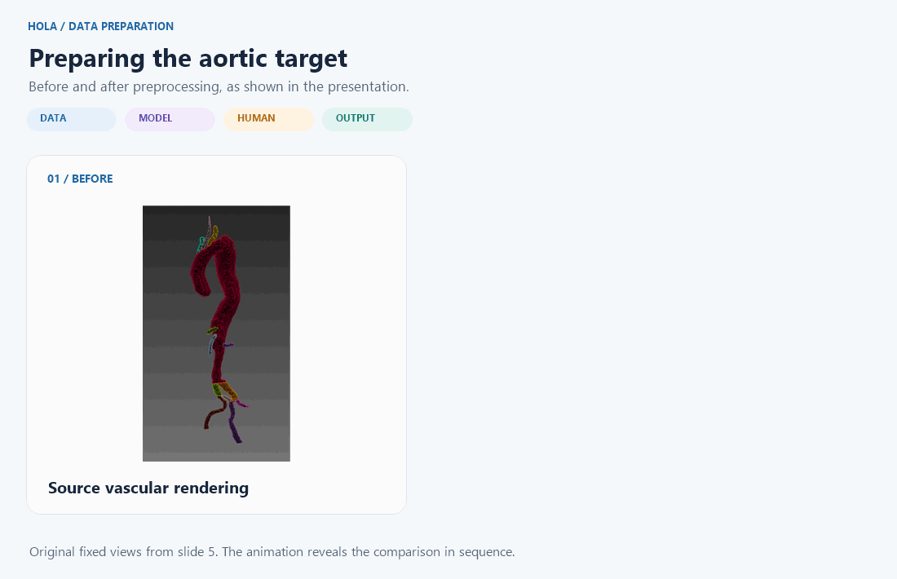

# HOLA

### Human–AI collaboration for aortic segmentation with quality feedback

HOLA combines **3D segmentation, corrective clicks, and quality estimation** to help users inspect aortic masks, refine their boundaries, and decide when to stop.

[Code usage](docs/usage.md) · [Viva presentation](docs/presentations/HOLA_Viva_Presentation.pptx) · [Data availability](#7-data-availability)

## Highlights

- **Segment in 3D** with a MONAI DynUNet trained across multiple cohorts.
- **Refine with human input:** positive clicks include tissue; negative clicks exclude it.
- **Estimate quality** from the CT and predicted mask, without reference labels at inference.

## 1. What is segmentation?

Segmentation labels each **voxel**, the 3D equivalent of a pixel, as target anatomy or background. Together, these labels form a **mask** that can be overlaid on CT slices or viewed in 3D.

*The rotating anatomy is a separate illustration from the CT example. [Still image](docs/images/segmentation-explained-still.png).*

## 2. What are we segmenting? The aorta

The **aorta** carries blood from the heart to the body. Its curved shape, branching vessels, and variable anatomy make consistent segmentation across slices challenging.

HOLA currently learns one **aortic foreground class** from prepared labels; individual branches are not separate output classes.

## 3. The segmentation backbone: MONAI DynUNet

**MONAI provides the framework; DynUNet provides the segmentation architecture.** HOLA trains this 3D encoder–decoder from scratch, using three input channels: **CT, positive clicks, and negative clicks**. Its output separates foreground from background. [Architecture reference](https://docs.monai.io/en/0.5.3/networks.html#dynunet).

## 4. How HOLA adds human interaction and quality feedback

HOLA connects prediction to **human review and correction**. A separate CNN estimates mask quality, supporting the decision to continue refining or finish review.

[View the complete flowchart](docs/images/hola-feedback-still.png).

Building on interactive methods such as [DeepEdit](https://docs.monai.io/en/1.4.0/applications.html), HOLA combines **click-driven volumetric segmentation with quality estimation and stopping feedback**.

<strong>See the prototype interface</strong>

*Prototype screenshots from slide 7. The interface source is not included in this checkout.*

## 5. How I developed HOLA

### Stage A — Learn to segment and respond to corrections

I combined six cohorts, fixed patient-level splits, and trained on augmented 3D patches. Mixing click-free examples with simulated corrections teaches DynUNet both initial prediction and refinement.

[Complete training flowchart](docs/images/development-segmentation-still.png).

### Stage B — Learn to estimate quality

A second CNN learns to predict Dice from CT and predicted-mask crops. Reference masks supply training targets; new predictions can be assessed without them. Validation data sets the feedback threshold.

[Complete quality flowchart](docs/images/development-quality-still.png) · [Training parameters and threshold selection](docs/usage.md#method-details)

The scripts implement training and evaluation; the viva demonstrates the complete interaction loop.

## 6. How the datasets are preprocessed

Preparation brings different cohorts into a common CT-and-mask format. The presentation illustrates the aortic target before and after preprocessing:

*Original fixed views from slide 5. [Still comparison](docs/images/preprocessing-comparison-still.png).*

The code loads prepared NIfTI pairs, merges nonzero labels into one foreground, normalizes CT intensity, and samples augmented patches. Quality training uses aligned CT/mask crops. Earlier dataset preparation is external to this checkout; its exact resampling and branch-selection procedure is not specified. [Implementation details](docs/usage.md#preprocessing-details).

## 7. Data availability

The viva lists **357 cases across six cohorts**. These are project cohort counts; scans and labels are obtained separately.

| Cohort | Cases | Access |
| --- | ---: | --- |
| Base | 43 | Not distributed here; public/private status unconfirmed. |
| SEGA | 55 | Public: [SEG.A.](https://multicenteraorta.grand-challenge.org/) / [AVT release](https://figshare.com/articles/dataset/Aortic_Vessel_Tree_AVT_CTA_Datasets_and_Segmentations/14806362). |
| Dissection | 40 | Public: [dataset release](https://figshare.com/articles/dataset/Aortic_Dissection_Dataset_and_Segmentations/22269091). |
| CIS-UNet | 59 | [Data agreement required](https://github.com/mirthAI/CIS-UNet#accessing-the-dataset). |
| AortaSeg60 | 60 | Public: [Zenodo](https://zenodo.org/records/18147026); automated masks. |
| TBAD | 100 | Public: [ImageTBAD](https://github.com/XiaoweiXu/Dataset_Type-B-Aortic-Dissection), distributed through Kaggle. |

The upstream AVT release contains 56 scans; the project uses 55. AortaSeg60 supplies automated labels rather than manually corrected expert masks.

## Explore the project

[Code usage and setup](docs/usage.md) · [Presentation](docs/presentations/HOLA_Viva_Presentation.pptx) · [Visual sources](docs/images/README.md)

Datasets, trained weights, external preprocessing code, and prototype interface source are not included.
