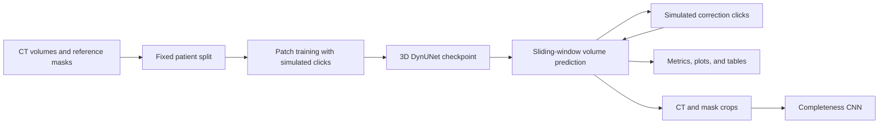

# Code usage

[Back to the project showcase](../README.md)

This guide covers configuration and running the existing experiment scripts. Run commands from the repository root.

## Setup

The checkout contains source scripts. Datasets, pretrained weights, dependency locks, and the imported `paths.py` configuration module are not included. Complete the configuration below before running experiments.

### 1. Prepare a Python environment

Create and activate a virtual environment, then install the core dependencies inferred from the source imports:

```sh
python -m venv .venv
# Windows PowerShell: .\.venv\Scripts\Activate.ps1
# Linux/macOS: source .venv/bin/activate
python -m pip install torch monai numpy scipy SimpleITK scikit-image matplotlib wandb
```

Dependency versions are not pinned in this repository. Use a PyTorch installation compatible with your compute environment. Core scripts select CUDA when available and otherwise use CPU; CUDA execution uses bfloat16 autocasting. Training defaults to a batch size of 24, configured in the training scripts.

### 2. Configure the output directory

Create `core/paths.py` with:

```python
from pathlib import Path

LOCAL_RESULTS_DIR = Path(__file__).resolve().parent.parent / "results"
LOCAL_RESULTS_DIR.mkdir(parents=True, exist_ok=True)
```

Each experiment script locates `core/` relative to its own file, so shared imports do not require a manual `PYTHONPATH` setting. This supplies the shared output path and creates it before the split writer or training scripts need it. The examples below assume this location.

### 3. Configure datasets

Update `DATASET_ROOTS` in [core/aorta_data.py](../core/aorta_data.py) to point to your local preprocessed data. The dataset keys are `base`, `sega`, `dissection`, `cisunet`, `aortaseg60`, and `tbad`; the checked-in paths refer to a specific cluster.

Each dataset root must follow this layout:

```text
dataset_root/
  patient_001/
    patient_001_image.nii.gz
    patient_001_label.nii.gz
  patient_002/
    patient_002_image.nii.gz
    patient_002_label.nii.gz
```

The loader expects aligned image/label volumes and combines all nonzero label values into a binary foreground mask. Patient identifiers take the form `dataset::patient_id`. Missing dataset directories return no patients, and folders without both files are skipped. Preprocessing is external to this repository.

### 4. Configure experiment logging

Training enables Weights & Biases by default. Run `wandb login` for online logging, set `WANDB_MODE=offline` in your environment for offline logging, or set `USE_WANDB = False` in the training script you use.

## Run an experiment

Run these commands from the repository root after completing setup.

### Create the shared patient split

```sh
python scripts/prepare/SplitPatients.py
```

This pools available patients across all configured datasets and writes `results/patient_split_3d.txt` using seed `0`. The split is shuffled globally, without dataset stratification. Keep the same split file across comparisons; rerunning this command overwrites it.

### Train a segmentation model

```sh
# Base dataset only
python scripts/train/Train.py --stage 0 --tag base --epochs 60

# Base plus all five optional datasets, ordered by available patient count
python scripts/train/Train.py --stage 5 --tag all_data --epochs 60

# Base plus two optional datasets selected by a seeded random order
python scripts/train/TrainR.py --stage 2 --order_seed 42 --tag random_order

# Sample up to 100 training patients from the pooled datasets
python scripts/train/TrainS.py --subset_size 100 --subset_seed 42 --tag subset100
```

Each run trains a new model from scratch. `--stage` controls how many optional datasets are added to the base dataset. Validation and test patients remain fixed across dataset selections.

At the default learning rate of `0.001`, the first command saves its best validation checkpoint to `results/deepedit_3d_base_lr0p001.pt`. Use distinct tags to keep experiment checkpoints separate.

### Evaluate quality and interaction effort

```sh
python scripts/evaluate/EvaluateTest.py --model_path results/deepedit_3d_base_lr0p001.pt --tag base
python scripts/evaluate/TargetClick.py --model_path results/deepedit_3d_base_lr0p001.pt --tag base
python scripts/evaluate/ClickQuality.py --model_path results/deepedit_3d_base_lr0p001.pt --tag base
```

- `EvaluateTest.py` records results at **0, 1, 3, 5, 8, and 10 correction steps**. The zero-correction result already includes initial seed clicks; it is not a fully unprompted prediction.
- `TargetClick.py` checks Dice targets of **0.70, 0.80, 0.85, 0.90, and 0.95**, with a default limit of 12 corrections.
- `ClickQuality.py` tests click correctness rates from **90% down to 0%**. Run `EvaluateTest.py` first with the same tag: the quality experiment reads its JSON output for the 100%-correct baseline.

### Train the completeness estimator

```sh
python scripts/quality/Completeness.py --model_path results/deepedit_3d_base_lr0p001.pt --splits train val
python scripts/quality/Completeness_classifier.py
```

The extractor saves two-channel CT/mask crops resized to `96 x 96 x 96`, paired with their actual Dice scores. It refuses test-split extraction. The CNN script makes its own patient-level training/validation split from the generated manifest, learns to predict Dice, and selects a threshold using an acceptable Dice level of `0.85`.

### Run MedSAM comparisons

The baseline scripts require separate model code and checkpoints. Configure their local import paths and checkpoint/configuration arguments before use:

- `Eval_MedSAM.py` imports `segment_anything` and accepts `--checkpoint`.
- `Eval_MedSAM2.py` imports the MedSAM2/SAM2 image predictor and accepts `--checkpoint`, `--model_cfg`, and `--n_clicks`.
- `Eval_MedSAM3.py` uses MedSAM2's `build_sam2_video_predictor_npz` and also requires OpenCV (`opencv-python`). Despite the filename, it evaluates **MedSAM2 volume propagation**.

All three accept `--tag` and `--split_path`. Their prompts and propagation strategies differ, so interpret results alongside the corresponding evaluation protocol. The MedSAM scripts use default unit spacing for HD95, while `EvaluateTest.py` reads physical image spacing.

## Generated artifacts

With the output configuration above, experiments write to `results/`:

| Artifact | Contents |
| --- | --- |
| `patient_split_3d.txt` | Shared training, validation, and test patient IDs. |
| `deepedit_3d_<tag>_lr<lr>.pt` | Best segmentation model weights. |
| `test_raw_results_<tag>.json` | Per-patient metrics, click coordinates, timing, and component diagnostics. |
| `metrics_table_<tag>.tex`, `metrics_table_<tag>_percohort.tex` | Aggregate and per-cohort evaluation tables. |
| `test_click_curve_<tag>.png`, `test_per_patient_<tag>.png` | Correction curves and patient-level performance plots. |
| `clicks_to_target_*` | Target-Dice interaction records, tables, and plots. |
| `completeness_samples/`, `completeness_training_manifest.json` | CT/mask crops and quality targets. |
| `completeness_cnn.pt`, `completeness_cnn_metadata.json` | Quality estimator weights, stopping threshold, and validation statistics. |

## How it works



CT intensities are clipped to `[-175, 250]` and scaled to `[0, 1]`. Training uses `64 x 128 x 128` patches, spatial and intensity augmentation, and a mixture of click-free and simulated-correction examples. Full-volume evaluation uses overlapping windows and filters small connected components.

The image-based framework diagram is in the [project showcase](../README.md). The diagram here maps the training and evaluation scripts available in this checkout. Clicks are simulated using reference masks and prediction errors.

## Repository guide

| File | Purpose |
| --- | --- |
| [aorta_data.py](../core/aorta_data.py) | Dataset discovery and NIfTI image/mask loading. |
| [SplitPatients.py](../scripts/prepare/SplitPatients.py) | Seeded patient split: approximately 60% training, 20% validation, and 20% test. |
| [Train.py](../scripts/train/Train.py) | Training with optional datasets ordered from smallest to largest; also supports subset sampling. |
| [TrainR.py](../scripts/train/TrainR.py) | Training with a seeded random order of optional datasets. |
| [TrainS.py](../scripts/train/TrainS.py) | Training variant for fixed-size subset experiments. |
| [Clicksim.py](../core/Clicksim.py) | Initial seed placement and positive/negative correction simulation. |
| [EvaluateTest.py](../scripts/evaluate/EvaluateTest.py) | Test metrics, correction curves, patient plots, and cohort tables. |
| [TargetClick.py](../scripts/evaluate/TargetClick.py) | Corrections needed to reach target Dice levels. |
| [ClickQuality.py](../scripts/evaluate/ClickQuality.py) | Performance under varying click correctness rates. |
| [Completeness.py](../scripts/quality/Completeness.py) | CT/mask crop generation with measured Dice targets. |
| [Completeness_classifier.py](../scripts/quality/Completeness_classifier.py) | CNN training to regress Dice and select a stopping threshold. |
| [Eval_MedSAM.py](../scripts/baselines/Eval_MedSAM.py) | MedSAM with a seed bounding box propagated slice by slice. |
| [Eval_MedSAM2.py](../scripts/baselines/Eval_MedSAM2.py) | MedSAM2 with simulated clicks on individual slices. |
| [Eval_MedSAM3.py](../scripts/baselines/Eval_MedSAM3.py) | MedSAM2 video-predictor propagation through a volume in both directions. |
